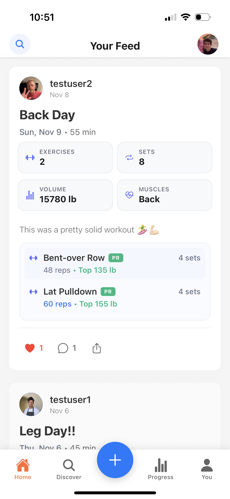
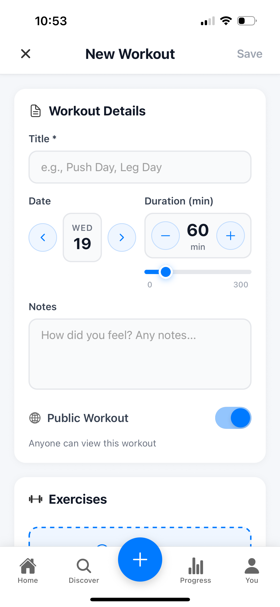
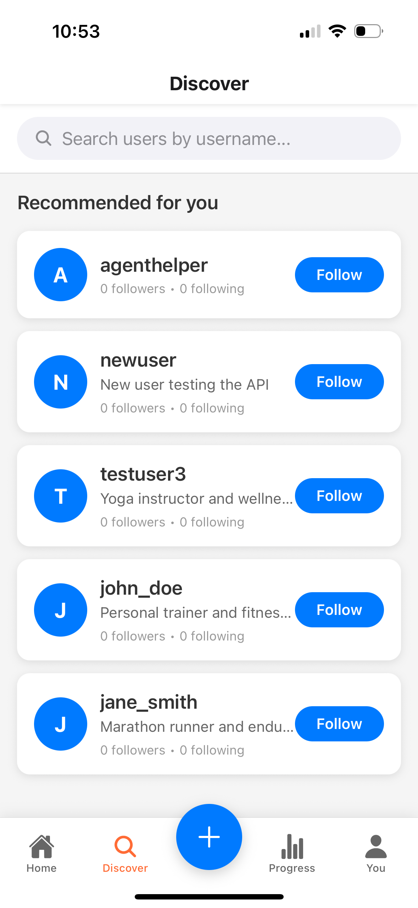
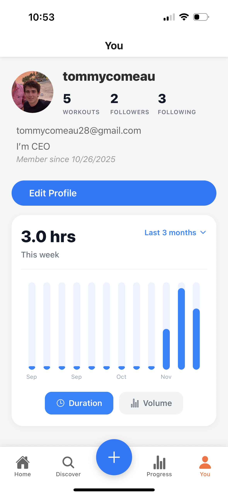
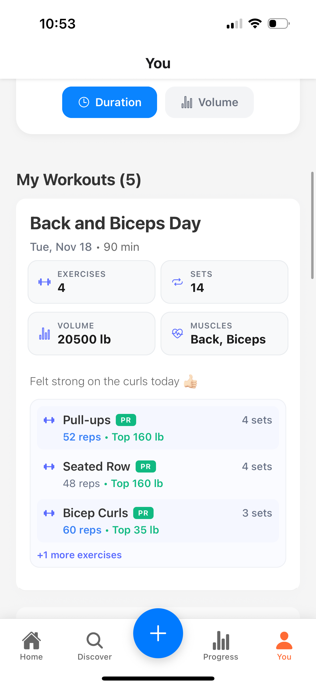

# Workout Social

A full-stack social fitness application that allows users to log workouts, track exercises, and share their fitness journey with others. Built with React Native (Expo) for mobile and Node.js/Express for the backend.

## 📸 Screenshots

<table>
<tr>
<td width="50%">

**Home Feed**
<br>

<br>
*View workouts from users you follow with detailed exercise previews, stats, and social interactions*

</td>
<td width="50%">

**Create Workout**
<br>

<br>
*Log your workouts with detailed exercise tracking, sets, reps, and weights*

</td>
</tr>
<tr>
<td width="50%">

**Progress Tracking**
<br>

<br>
*Browse exercises by muscle group and track your progress over time*

</td>
<td width="50%">

**Exercise Search**
<br>

<br>
*Discover new exercises with comprehensive search and filtering options*

</td>
</tr>
<tr>
<td width="50%">

**User Profile**
<br>

<br>
*View your profile with workout statistics, weekly analytics, and activity charts*

</td>
<td width="50%">

**Profile Workouts**
<br>

<br>
*Browse your workout history with detailed exercise information and progress tracking*

</td>
</tr>
<tr>
<td width="50%">

**Login Screen**
<br>

<br>
*Modern login experience with gradient background, icons, password visibility toggle, and inline validation*

</td>
<td width="50%">

</td>
</tr>
</table>

## 🏋️ Features

### Core Functionality
- **User Authentication**: Secure registration and login system with enhanced UX
- **Onboarding Flow**: Beautiful 4-screen onboarding experience for first-time users
- **Workout Logging**: Create and track detailed workout sessions
- **Exercise Library**: Comprehensive database of exercises with muscle groups and equipment types
- **Set Tracking**: Log individual sets with reps, weight, and rest time
- **Social Features**: Follow other users, like workouts, and leave comments
- **Profile Management**: Customizable user profiles with bio and profile pictures

### Mobile App (React Native/Expo)
- **Cross-platform**: Works on both iOS and Android
- **Onboarding Experience**: Interactive 4-screen onboarding with gradient backgrounds and smooth animations
- **Enhanced Login Screen**: Modern design with gradient background, icons, password visibility toggle, inline validation, and haptic feedback
- **Tab Navigation**: Home, Progress, and Profile screens
- **Discover & Follow**: Search for users, follow them, and view their workouts
- **Progress Tracking**: Profile dashboard with weekly duration chart and exercise analytics
- **Exercise Analytics**: Progress tab with muscle-group browsing and per-exercise history (heaviest weight, sessions, etc.)
- **Authentication Flow**: Seamless login/register experience with auto-focus navigation
- **Real-time Updates**: Live feed of workouts from followed users

### Backend API (Node.js/Express)
- **RESTful API**: Well-structured endpoints for all features
- **PostgreSQL Database**: Robust data storage with proper relationships
- **JWT Authentication**: Secure token-based authentication
- **CORS Enabled**: Cross-origin resource sharing for mobile app

## 🛠️ Tech Stack

### Frontend (Mobile)
- **React Native** with Expo
- **React Navigation** for navigation
- **React Native SVG** for custom progress charts
- **Expo Linear Gradient** for beautiful gradient backgrounds
- **Expo Haptics** for tactile feedback
- **TypeScript** for type safety
- **AsyncStorage** for local data persistence

### Backend
- **Node.js** with Express.js
- **TypeScript** for type safety
- **PostgreSQL** database
- **bcrypt** for password hashing
- **JWT** for authentication
- **CORS** for cross-origin requests

## 🚀 Getting Started

### Prerequisites
- Node.js (v16 or higher)
- PostgreSQL database
- Expo CLI (for mobile development)
- iOS Simulator or Android Emulator (for testing)

### Backend Setup

1. Navigate to the backend directory:
```bash
cd backend
```

2. Install dependencies:
```bash
npm install
```

3. Set up environment variables:
Create a `.env` file in the backend directory:
```env
PORT=3000
DB_HOST=localhost
DB_PORT=5432
DB_NAME=workout_social
DB_USER=your_username
DB_PASSWORD=your_password
JWT_SECRET=your_jwt_secret
```

4. Set up the database:
```bash
# Create the database
createdb workout_social

# Run the schema
psql workout_social < src/db.sql

# Seed with sample data (optional)
psql workout_social < src/seed_exercises.sql
psql workout_social < src/seed_test_users.sql
```

5. Start the development server:
```bash
npm run dev
```

The API will be available at `http://localhost:3000`

### Mobile App Setup

1. Navigate to the mobile directory:
```bash
cd mobile
```

2. Install dependencies:
```bash
npm install
```

3. Start the Expo development server:
```bash
npm start
```

4. Run on your preferred platform:
```bash
# iOS
npm run ios

# Android
npm run android

# Web (for testing)
npm run web
```

## 📊 Database Schema

The application uses PostgreSQL with the following main tables:

- **users**: User accounts and profiles
- **workouts**: Workout sessions
- **exercises**: Exercise library
- **workout_exercises**: Exercises within workouts
- **sets**: Individual sets within exercises
- **follows**: User following relationships
- **likes**: Workout likes
- **comments**: Workout comments

## 🔗 API Endpoints

### Authentication
- `POST /api/auth/register` - User registration
- `POST /api/auth/login` - User login
- `GET /api/auth/profile` - Get user profile

### Workouts
- `GET /api/workouts` - Get user's workouts
- `POST /api/workouts` - Create new workout
- `PUT /api/workouts/:id` - Update workout
- `DELETE /api/workouts/:id` - Delete workout

### Exercises
- `GET /api/exercises` - Get exercise library
- `GET /api/exercises/:id` - Get specific exercise
- `GET /api/workouts/exercise-progress/:exerciseId` - Get per-exercise progress metrics for the authenticated user

### Social Features
- `GET /api/social/feed` - Get social feed
- `POST /api/social/follow/:userId` - Follow user
- `POST /api/social/like/:workoutId` - Like workout
- `POST /api/social/comment` - Add comment

## 🤝 Contributing

1. Fork the repository
2. Create a feature branch (`git checkout -b feature/amazing-feature`)
3. Commit your changes (`git commit -m 'Add some amazing feature'`)
4. Push to the branch (`git push origin feature/amazing-feature`)
5. Open a Pull Request

## 📝 License

This project is licensed under the ISC License - see the [LICENSE](LICENSE) file for details.

## 👨‍💻 Author

**Thomas Comeau** - Full-stack developer

## 🙏 Acknowledgments

- Exercise database inspired by popular fitness applications
- UI/UX patterns from modern social media apps
- Community feedback and suggestions
